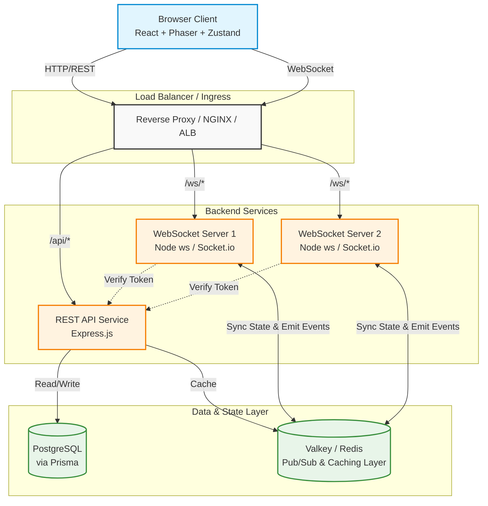

# Metaverse Architecture & Monorepo 🌌


An advanced, highly-scalable 2D Real-Time Metaverse built with modern web technologies. This repository is configured strictly as a **Turborepo monorepo**, containing dedicated microservices for the frontend client, RESTful backend APIs, and a blazing-fast real-time WebSocket server.

---

## ✨ Key Features

- **Real-Time Multiplayer Experience:** Powered by **Phaser 3** for deterministic 2D rendering and **WebSockets** for low-latency synchronization of player coordinates and actions.
- **Infinitely Scalable Architecture:** Built to scale horizontally using **Valkey** (a high-performance Redis alternative) for distributed Pub/Sub state synchronization.
- **Robust Monorepo Design:** Efficiently managed by **Turborepo** with shared packages for Types, UI components, and JWT authentication across apps.
- **Type-Safe End-to-End:** 100% TypeScript with strict linting and unified configurations.
- **Modern Tech Stack:** Utilizes React 19, Vite, Tailwind CSS, Express, Prisma ORM, and Socket.io.

---

## 🏗 System Architecture

The architecture is explicitly designed to handle high concurrency and provide real-time updates across multiple instances safely.



---

## 📦 Project Structure

The codebase is organized into modular `apps` and `packages` to promote extreme reusability and fast isolated deployments.

### Apps (`/apps`)
| Application | Description |
| :--- | :--- |
| **`frontend`** | Vite + React + Phaser web application. Handles the UI, rendering the 2D metaverse, and maintaining local state via Zustand. |
| **`api`** | Express-based robust REST API handling user authentication, profile creation, settings, and persistent database interactions via Prisma. |
| **`wserver`** | High-performance WebSocket Node.js server managing real-time player movements, chat, and spatial synchronization. |

### Packages (`/packages`)
| Package | Description |
| :--- | :--- |
| **`types`** | `@myapp/types` - Shared TypeScript definitions so the API, WServer, and Frontend share the exact same payload interfaces. |
| **`ui`** | Reusable React components and Tailwind configuration. |
| **`jwt`** | `@shared/jwt` - Shared JWT authentication and validation logic. |
| **`eslint-config`** | Shared ESLint configurations used throughout the monorepo. |
| **`typescript-config`** | Shared base `tsconfig.json` setups. |

---

## 🚀 Scalability & Performance Details

The metaverse architecture natively supports **horizontal scaling**:

1. **Stateless API:** The `apps/api` service is completely stateless and can scale to handle massive concurrent REST requests without sticky sessions tracking.
2. **Distributed WebSocket Servers:** `apps/wserver` is designed using Socket.io/ws alongside `@valkey/valkey-glide` (a highly tuned Redis client). It uses the adapter pattern to distribute events via **Pub/Sub**. When a user moves on server instance `WS1`, the event is published to Valkey, ensuring clients connected to completely different nodes (e.g., `WS2`) receive the update instantly.
3. **Database Optimization:** Prisma is used with proper connection pooling logic to interact with the PostgreSQL connection limits intelligently.

---

## 🏃 Getting Started

### Prerequisites
Before you begin, ensure you have the following installed:
- [Node.js](https://nodejs.org/) (v18 or higher)
- npm (v11+ recommended) or [pnpm](https://pnpm.io/)
- A local or Dockerized **Valkey** (or Redis) server
- A local or remote **PostgreSQL** database

### 1. Installation

Clone the repository and install all dependencies from the root:

```bash
git clone https://github.com/your-org/metaverse.git
cd metaverse
npm install
```

### 2. Environment Setup

You need to configure the environment variables for each respective application.

Copy `.env.example` to `.env` in the following directories:
- `apps/api/.env`
- `apps/wserver/.env`
- `apps/frontend/.env`

*(Ensure your `DATABASE_URL` and `REDIS_URL` are set correctly matching your local infrastructure).*

### 3. Database Migration

Initialize your database schema by running the Prisma migrations:

```bash
cd apps/api
npx prisma generate
npx prisma migrate dev
```

### 4. Running the Development Server

To boot up the entire stack concurrently (API, WebSocket Server, and Frontend) using Turborepo's pipeline:

```bash
# From the root directory:
npm run dev
```

- **Frontend** will be running on `http://localhost:5173` (or Vite's default)
- **API** will be running on your configured API port.
- **WebSocket Server** will be listening on your configured WS port.

---

## 🛠 Complete Tech Stack

- **Game Engine:** Phaser 3
- **Frontend Framework:** React 19, Vite, Zustand
- **Styling:** TailwindCSS, Lucide React
- **Event / Real-Time:** WebSockets (`ws`, `socket.io-client`), Valkey / Redis
- **Backend APIs:** Express.js, Prisma ORM, Zod Validation, JWT Auth
- **Infrastructure / CLI:** Turborepo, TypeScript integration, Node.js

---

> Built with Turborepo and maintained by the engineering team.
